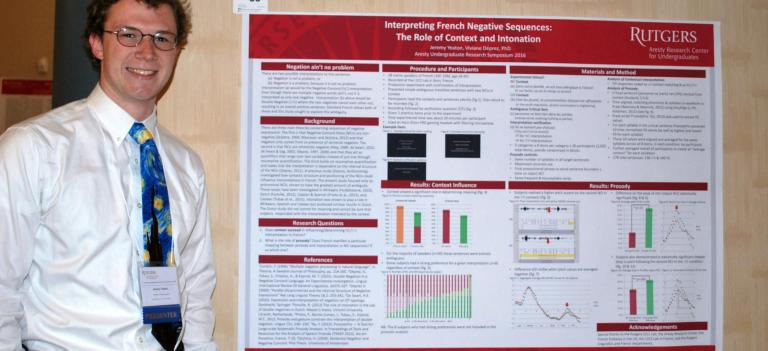

## About me
I'm a second-year master's student in Cognitive Science at the École normale supérieure in Paris, and am fascinated with how meaning and structure in language are represented in the brain, as well as how the representations of languages might interact in speakers (or signers) who know more than one.

Before starting my master's, I double majored in Linguistics and French, and minored in Chinese at Rutgers University - New Brunswick. After graduating, I worked for a year at the US Department of State's language school outside Washington, DC. The next year I lived in [Haskovo, Bulgaria](https://en.wikipedia.org/wiki/Haskovo) and taught English to high schoolers on a Fulbright grant.

My master's thesis is an experimental project examining the impact of proficiency and executive functioning on the processing of syntactic (in this case word order) violations in second language processing. See [here](https://jdyeaton27.github.io/research) for some of my other projects.
